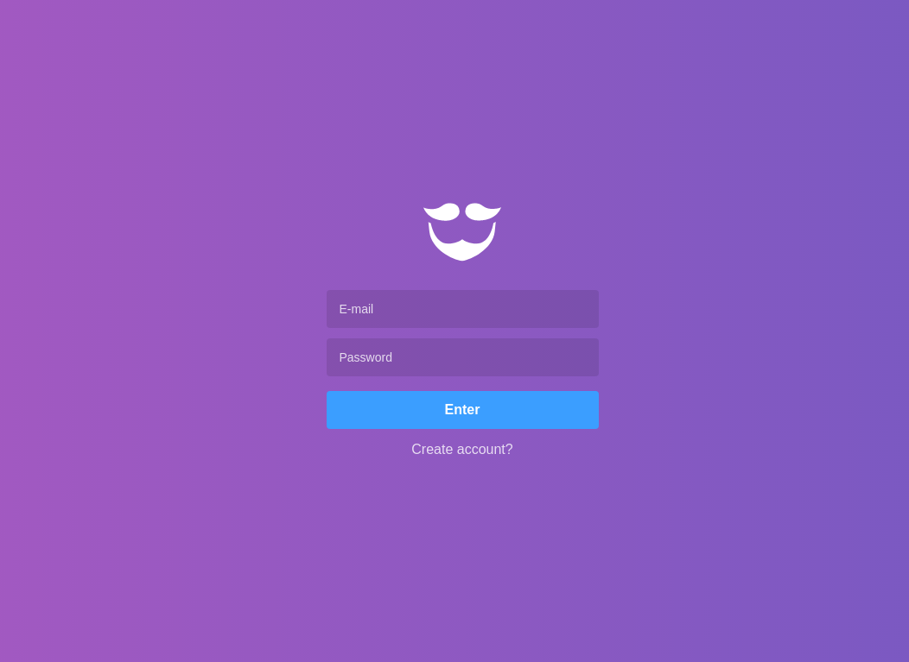

# Go Barber API




Go Barber is a barber scheduling application. The main objective is to organize the schedules of barbershop.


## Start Server

```
-> ~/yarn

-> ~/yarn dev
```
## Front End Repository

```
https://github.com/teles1g/go-barber-api
```

## Mobile Repository

```
https://github.com/teles1g/go-barber-react-native
```